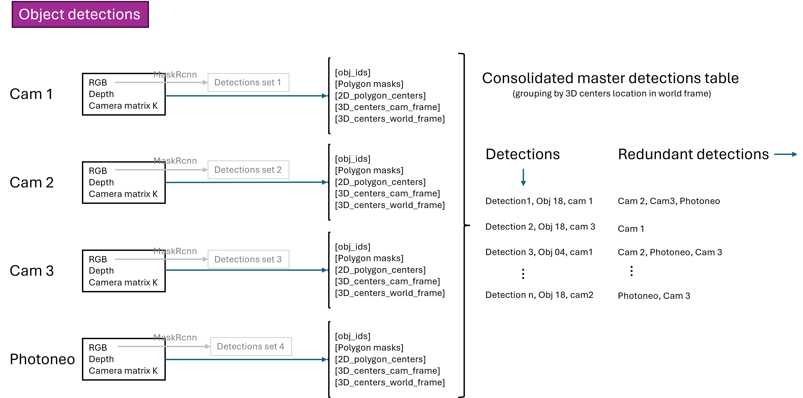
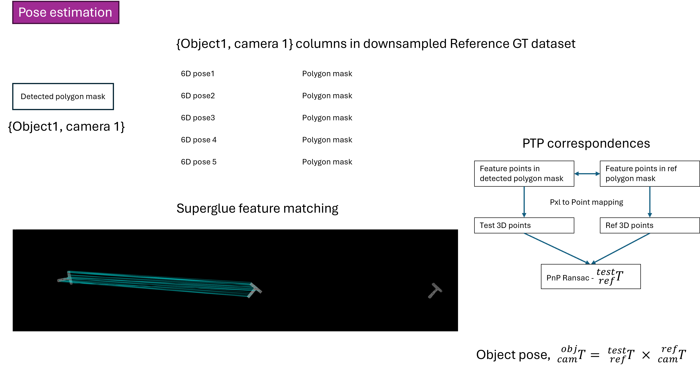

# Test Results Visualizer

A comprehensive GUI application for visualizing and analyzing computer vision datasets, ground truth annotations, and object detection test results with 6D pose estimation capabilities.

## Features

### Ground Truths Visualization Tab
- **Dataset Processing**: Read and process multi-camera RGB-D datasets
- **3D Models Integration**: Load and associate 3D object models with scene data
- **Ground Truth Visualization**: Display RGB images with mask overlays and bounding boxes
- **3D Point Cloud Generation**: Create colored point clouds from RGB-D data
- **Pose Visualization**: View ground truth 6D object poses in 3D space
- **Training Data Analysis**: Analyze class distributions and dataset statistics
- **Mask R-CNN Training Interface**: Prepare data for model training

### Test Results Visualization Tab
- **Test Dataset Processing**: Process test scenes for object detection evaluation
- **Object Detection Pipeline**: Run Mask R-CNN inference on test images
- **Detection Consolidation**: Merge multi-view detections using clustering algorithms
- **Feature Matching**: Perform SuperGlue-based feature matching between views
- **6D Pose Estimation**: Compute object poses in camera and world coordinates
- **Multi-View Navigation**: Browse through detection results across different camera views
- **3D Results Visualization**: Display detected objects and estimated poses in 3D space

## Requirements

### Python Dependencies
```
tkinter
opencv-python (cv2)
numpy
open3d
PIL (Pillow)
json
csv
threading
collections
```

### Hardware Requirements
- GPU support recommended for point cloud processing and inference
- Sufficient RAM for large point cloud visualization
- OpenGL support for 3D visualization

## Installation

1. Clone the repository:
```bash
git clone [your-repository-url]
cd test-results-visualizer
```

2. Install required dependencies:
```bash
pip install opencv-python numpy open3d pillow
```

3. Ensure you have the required helper modules in the `helpers/` directory:
- `read_dataset.py`
- `read_test_dataset.py` 
- `pxl_2_point.py`
- `process_scene_data.py`

## Usage

### Starting the Application
```bash
python ui.py
```

### Ground Truths Tab Workflow

1. **Select Dataset Root Folder**: Choose the main dataset directory containing RGB images and depth data
2. **Select 3D Models Path**: Choose directory containing 3D object models (.ply files)
3. **Process Dataset**: Click "Read Dataset" to generate master CSV with scene annotations
4. **Load Image + PCL**: Select a row from the CSV table and load corresponding RGB-D data
5. **Visualize in 3D**: Click "Open 3D Viewer" to see point cloud with ground truth poses

### Test Results Tab Workflow

1. **Select Dataset Path**: Choose test dataset directory
2. **Process Test Dataset**: Generate test CSV with scene information
3. **Load Image + PCL**: Select a scene and load RGB-D data
4. **Run Detection**: Execute the full detection and pose estimation pipeline
5. **Navigate Results**: Use arrow buttons to browse through detection results and feature correspondences
6. **Visualize in 3D**: View point cloud with estimated object poses

## Method

This application implements a multi-view object detection and 6D pose estimation pipeline for RGB-D datasets. The method consists of several key stages:

### Pipeline Overview

The detection pipeline processes multi-camera RGB-D scenes through the following stages. The system consolidates detections across multiple camera views using spatial clustering and feature-based correspondence.






---

The method leverages:
- **Mask R-CNN** for initial object detection and segmentation
- **Multi-view geometric constraints** for detection consolidation
- **SuperGlue feature matching** for establishing correspondences
- **PnP algorithms** for 6D pose estimation
- **Point cloud registration** for pose refinement

## File Structure

```
├── ui.py                          # Main application entry point
├── ground_truths_tab.py           # Ground truth visualization interface
├── test_results_tab.py            # Test results visualization interface
├── helpers/
│   ├── read_dataset.py            # Dataset processing utilities
│   ├── read_test_dataset.py       # Test dataset processing
│   ├── pxl_2_point.py            # Point cloud generation
│   └── process_scene_data.py      # Scene processing and detection pipeline
└── meta_data/                     # Generated CSV files and metadata
```

## Dataset Format

### Expected Directory Structure
```
dataset_root/
├── rgb_cam1/                      # RGB images from camera 1
├── rgb_cam2/                      # RGB images from camera 2
├── rgb_photoneo/                  # RGB images from Photoneo camera
├── depth_cam1/                    # Corresponding depth images
├── depth_cam2/
├── depth_photoneo/
├── scene_camera_cam1.json         # Camera intrinsic parameters
├── scene_camera_cam2.json
└── scene_camera_photoneo.json
```

### Camera Parameter Format
```json
{
  "0": {
    "cam_K": [fx, 0, cx, 0, fy, cy, 0, 0, 1],
    "depth_scale": 1000
  }
}
```

## Features and Controls

### Image Visualization
- **Zoom Controls**: Use +/- buttons to zoom in/out of images
- **Pan Navigation**: Click and drag to pan around zoomed images
- **Multi-View Navigation**: Use arrow buttons to switch between camera views
- **Mask Overlays**: Ground truth masks and detection results overlay on RGB images

### 3D Visualization
- **Point Cloud Display**: Colored 3D point clouds from RGB-D data
- **Pose Markers**: Coordinate frames showing object orientations
- **Interactive Navigation**: Mouse controls for 3D scene exploration
- **Multi-Object Support**: Simultaneous visualization of multiple detected objects

## Troubleshooting

### Common Issues

**"No folder selected" Error**
- Ensure you've selected both dataset root folder and 3D models path before processing

**"Depth image not found" Error**
- Check that depth images exist in expected directories (depth_cam1/, depth_photoneo/, etc.)
- Verify image filenames match between RGB and depth directories

**Point Cloud Display Issues**
- Ensure depth_scale parameter is correct for your dataset
- Check that camera intrinsic parameters are properly formatted
- Verify OpenGL support for 3D visualization

**Memory Issues with Large Datasets**
- Close 3D viewer windows when not needed
- Process smaller subsets of data for testing
- Ensure sufficient RAM for point cloud processing

**Detection Pipeline Errors**
- Verify all helper modules are present in helpers/ directory
- Check that required model files are accessible
- Ensure GPU memory is sufficient for inference

### Performance Tips

- Use appropriate image scaling for large datasets
- Close unused visualization windows
- Process test scenes in smaller batches
- Enable GPU acceleration when available

## Output Files

The application generates several output files in the `meta_data/` directory:

- `master_dataset_[timestamp].csv`: Complete dataset annotations with ground truth poses
- `test_dataset.csv`: Test scene information for evaluation
- Temporary detection and feature matching results

## Contributing

When adding new features:
1. Follow the existing tab-based architecture
2. Implement proper error handling for file I/O operations
3. Add progress indicators for long-running operations
4. Maintain consistent UI styling with existing tabs

## License

[Insert your license information here]